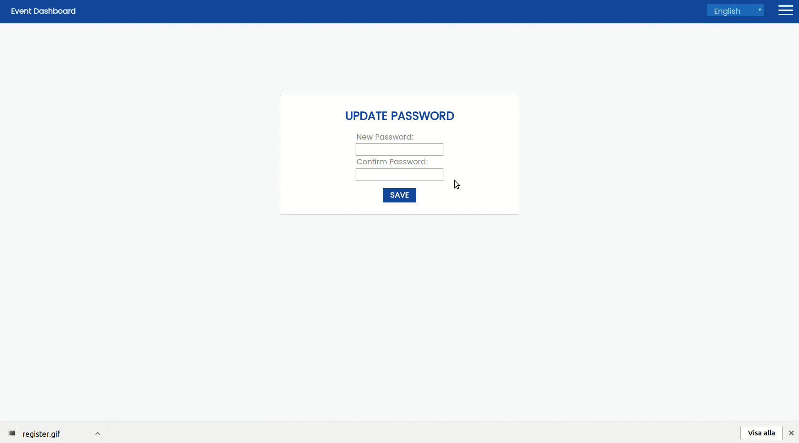
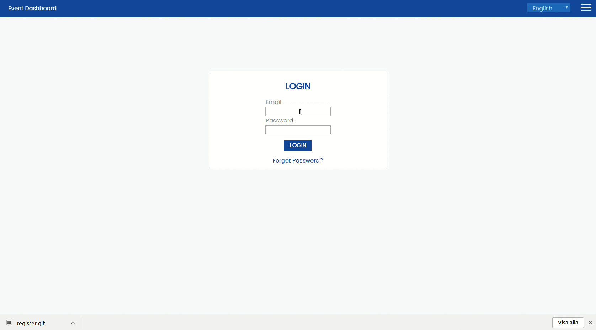
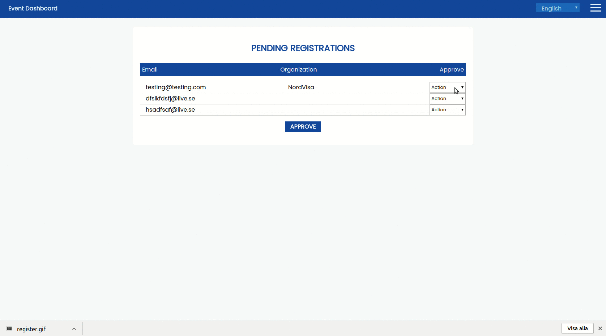
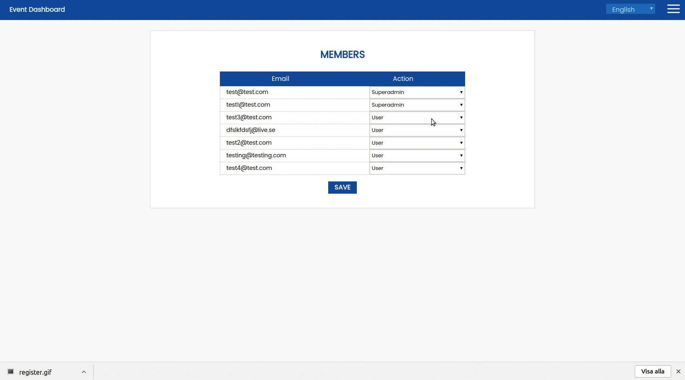
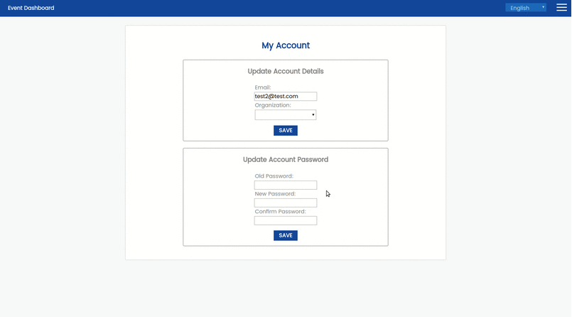
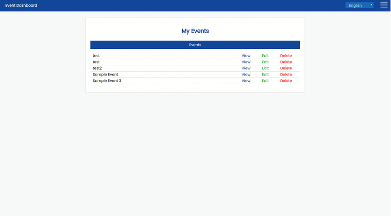
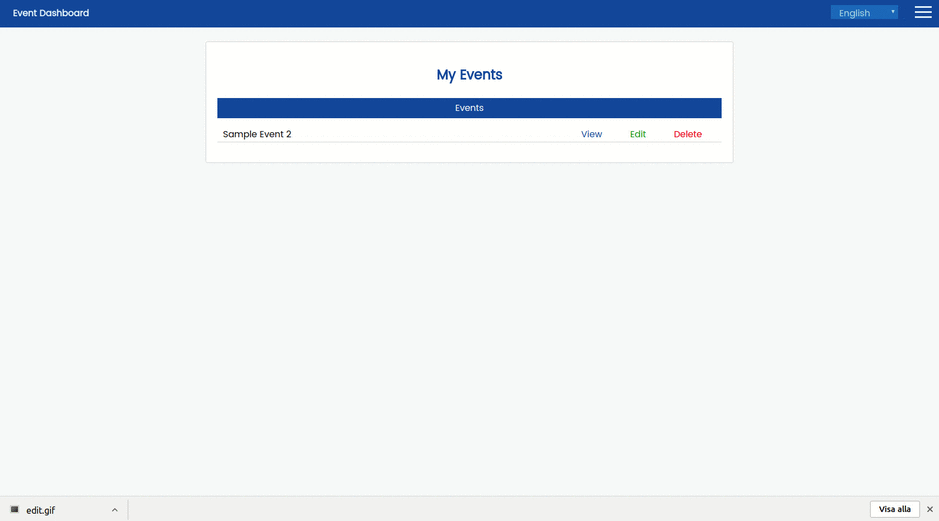
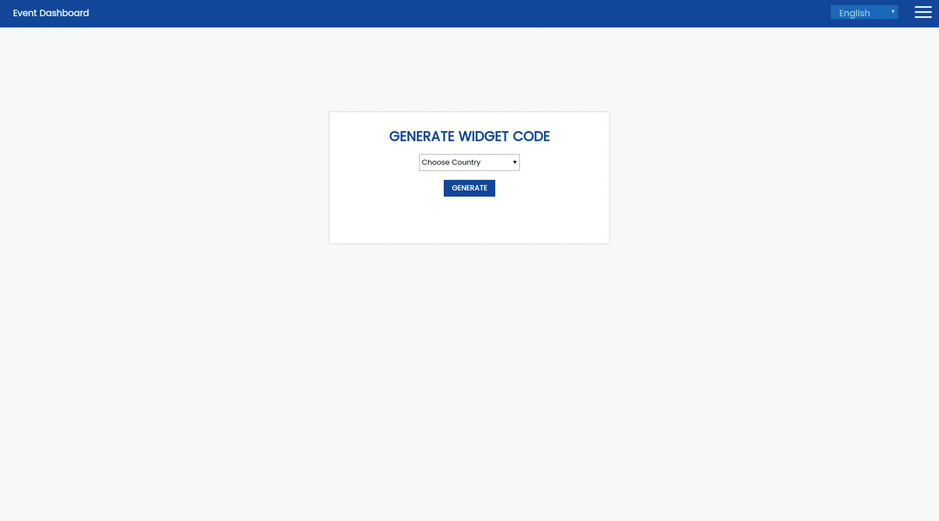

# Nordvisa Calendar
## About
This is an open source event management application created as a project at Linnaeus University for the course 2DV603 in collaboration with NordVisa.

The application is divided into two parts, the administrative dashboard and the widget. The administrative dashboard is where authorized users can view, create, update, and delete location based events. The dashboard also has a feature rich user management system for handling users in the system. The widget can be embedded into any websites to display events within a specified area.

## Installation
1. Install MongoDB
1. Download the latest version from [Releases](https://github.com/2DV603NordVisaProject/nordvisa_calendar/releases). Both .tar and .zip are available
1. Unzip the files
1. Open the application.properties file, edit to suit your needs
1. Start the application by running `java -jar nordvisa_calendar-x.x.x.jar` (Replace x with version numbers)

## How to use / Features
### Register

Register a new account. Joint an existing organization, create a new one or do not join one at all.

### Request Reset Password Link & Update Password

Request a reset password link to be sent to your email, which allow you to change your password.

### Login

### Approve and Deny Registrations

As a administrator you can approve and deny registrations manually.

### Manage Users Access

As a administrator you can manage and delete users access to the system.

### Manage Your Account

Change your email, password or organization.

### Create Events

### View Events

### Delete & Edit Events

### Multi Language Support

### Generate Widget Code

Generate code snippets and past them into your website to embedd a event calendar widget.

## Set up development environment
#### With Vagrant
1. [Install Vagrant](https://www.vagrantup.com/docs/installation/)
1. Navigate to project root.
1. Run `vagrant up` to build and start the machine
1. Run `vagrant ssh` to get control of the virtual machine

#### Without Vagrant
1. Install Java 8
1. Install Gradle
1. Install MongoDB
1. Install NodeJS

## Build application
1. Install any dependencies for the client. Navigate into the `client` folder and run `npm install`
1. Run the build to server script in the project root folder `./buildToServer.sh`
1. Build .jar file. Navigate into server folder. Run `gradle build`

## License
### MIT
Copyright 2017 NordVisa, Axel Nilsson, Johan Gudmundsson, Leif Karlsson, Francis Menkes, Feiyu Xiong

Permission is hereby granted, free of charge, to any person obtaining a copy of this software and associated documentation files (the "Software"), to deal in the Software without restriction, including without limitation the rights to use, copy, modify, merge, publish, distribute, sublicense, and/or sell copies of the Software, and to permit persons to whom the Software is furnished to do so, subject to the following conditions:

The above copyright notice and this permission notice shall be included in all copies or substantial portions of the Software.

THE SOFTWARE IS PROVIDED "AS IS", WITHOUT WARRANTY OF ANY KIND, EXPRESS OR IMPLIED, INCLUDING BUT NOT LIMITED TO THE WARRANTIES OF MERCHANTABILITY, FITNESS FOR A PARTICULAR PURPOSE AND NONINFRINGEMENT. IN NO EVENT SHALL THE AUTHORS OR COPYRIGHT HOLDERS BE LIABLE FOR ANY CLAIM, DAMAGES OR OTHER LIABILITY, WHETHER IN AN ACTION OF CONTRACT, TORT OR OTHERWISE, ARISING FROM, OUT OF OR IN CONNECTION WITH THE SOFTWARE OR THE USE OR OTHER DEALINGS IN THE SOFTWARE.
