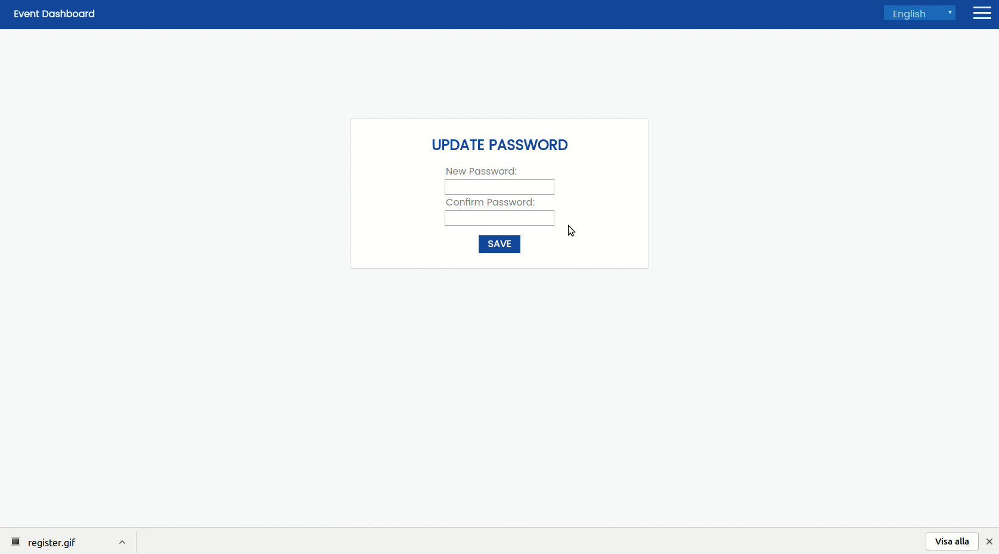
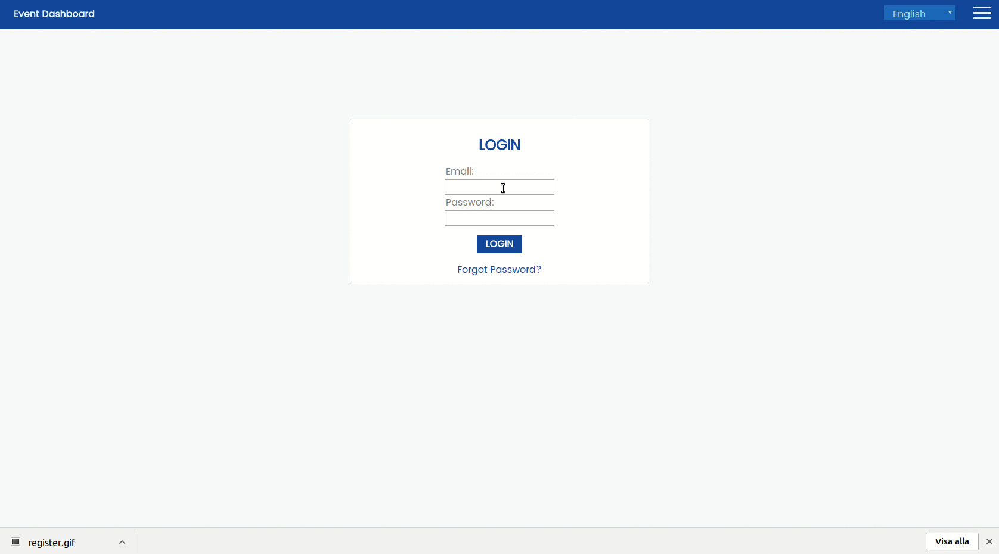
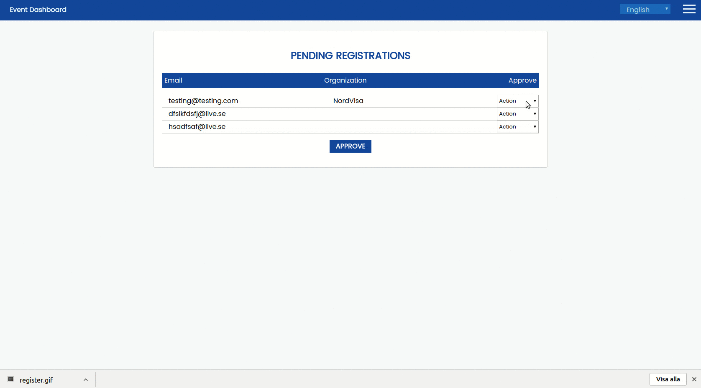
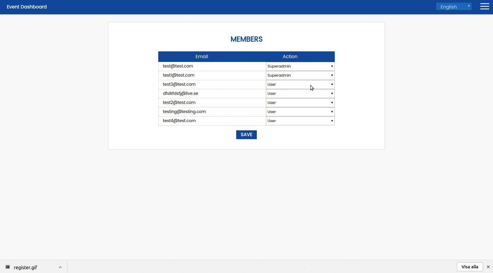
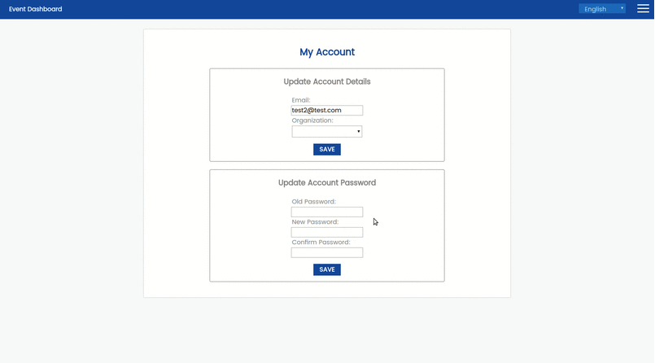
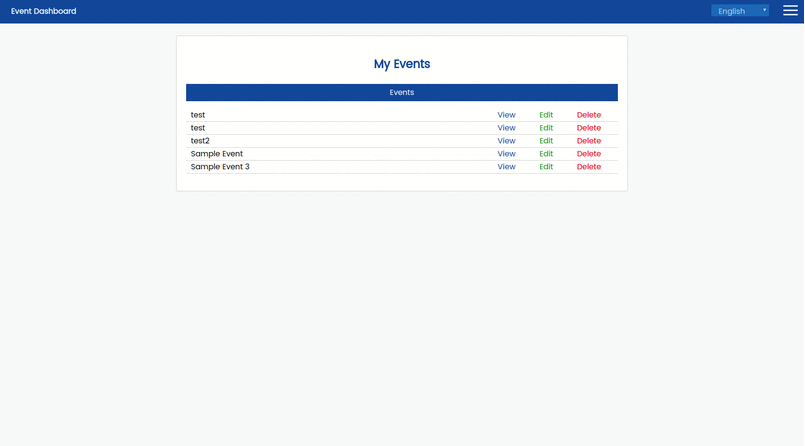
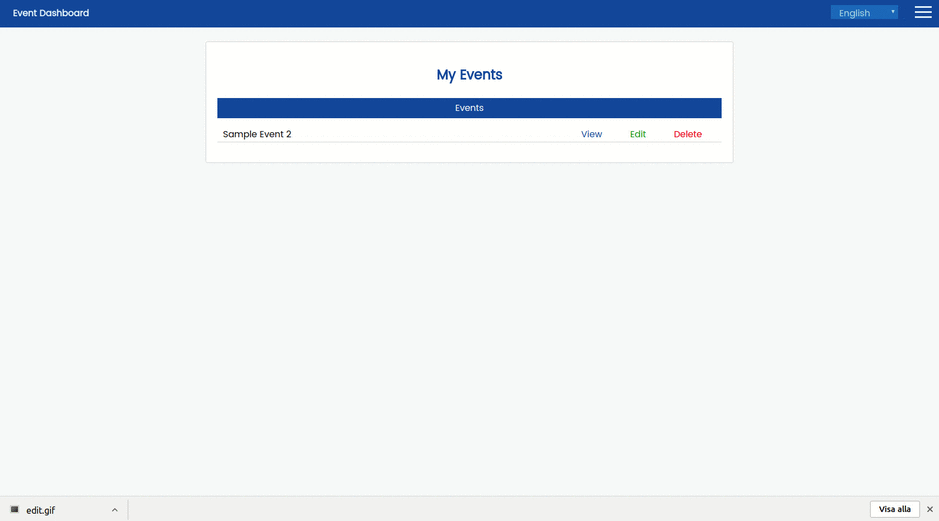
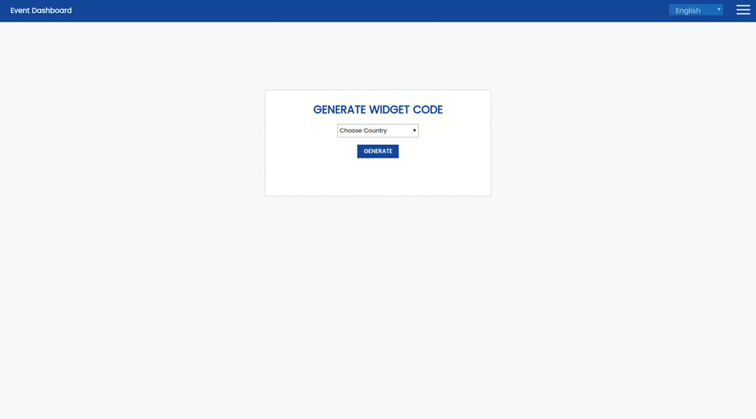

# Nordvisa Calendar
## About
This is the repository of a project done at Linnaeus University for the course 2DV603. This was done in collaboration with NordVisa.

## Installation
1. Download the latest version from [Releases](https://github.com/2DV603NordVisaProject/nordvisa_calendar/releases). Both .tar and .zip are available
1. Unzip the files
1. Open the application.properties file, edit to suit your needs
1. Start the application by running `java -jar nordvisa_calendar-x.x.x.jar` (Replace x with version numbers)

## Set up development environment
To be added soon...

## How to use / Features
### Register

Register a new account. Joint an existing organization, create a new one or do not join one at all.

### Request Reset Password Link & Update Password

Request a reset password link to be sent to your email, which allow you to change your password.

### Login

### Approve and Deny Registrations

As a administrator you can approve and deny registrations manually.

### Manage Users Access

As a administrator you can manage and delete users access to the system.

### Manage Your Account

Change your email, password or organization.

### Create Events

### View Events

### Delete & Edit Events

### Multi Language Support

### Generate Widget Code

Generate code snippets and past them into your website to embedd a event calendar widget.

## License
### MIT
Copyright 2017 NordVisa, Axel Nilsson, Johan Gudmundsson, Leif Karlsson, Francis Menkes, Feiyu Xiong

Permission is hereby granted, free of charge, to any person obtaining a copy of this software and associated documentation files (the "Software"), to deal in the Software without restriction, including without limitation the rights to use, copy, modify, merge, publish, distribute, sublicense, and/or sell copies of the Software, and to permit persons to whom the Software is furnished to do so, subject to the following conditions:

The above copyright notice and this permission notice shall be included in all copies or substantial portions of the Software.

THE SOFTWARE IS PROVIDED "AS IS", WITHOUT WARRANTY OF ANY KIND, EXPRESS OR IMPLIED, INCLUDING BUT NOT LIMITED TO THE WARRANTIES OF MERCHANTABILITY, FITNESS FOR A PARTICULAR PURPOSE AND NONINFRINGEMENT. IN NO EVENT SHALL THE AUTHORS OR COPYRIGHT HOLDERS BE LIABLE FOR ANY CLAIM, DAMAGES OR OTHER LIABILITY, WHETHER IN AN ACTION OF CONTRACT, TORT OR OTHERWISE, ARISING FROM, OUT OF OR IN CONNECTION WITH THE SOFTWARE OR THE USE OR OTHER DEALINGS IN THE SOFTWARE.
